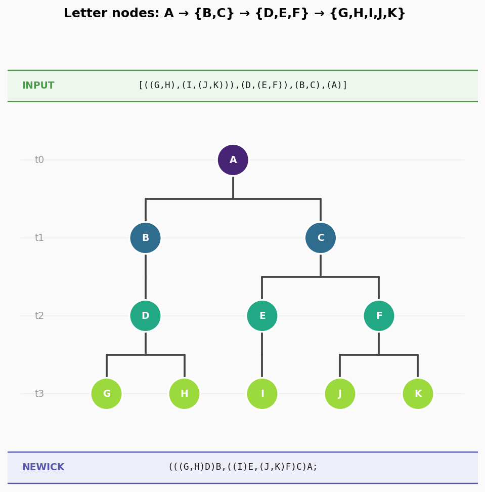
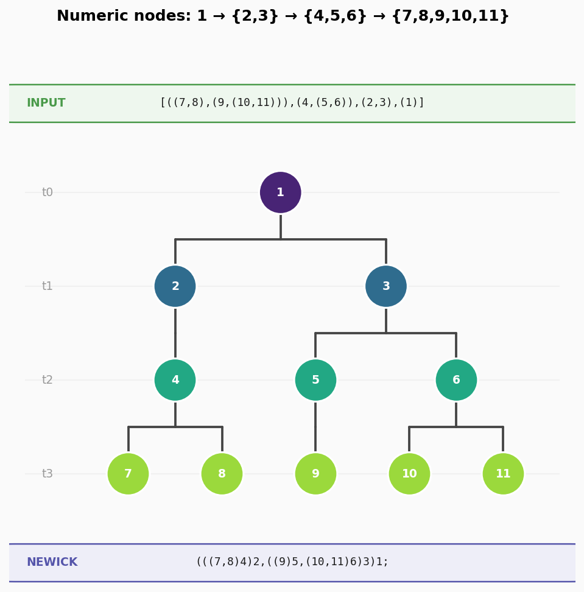
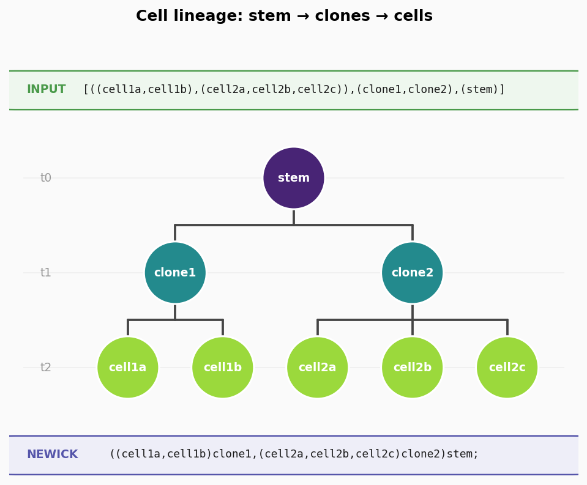

# lineage-tree

Convert and visualise lineage trees written in a **nested-tuple timepoint format** into standard [Newick](https://en.wikipedia.org/wiki/Newick_format) strings and cladogram-style figures.



---

## Format description

The input is a **list of timepoints**, ordered **latest → earliest** (root last).

```
[((G,H),(I,(J,K))),(D,(E,F)),(B,C),(A)]
  ─────────────── ─────────  ──────  ─
    timepoint 3    t2         t1     t0 (root)
```

Each timepoint's nested structure mirrors the previous one positionally:

| From → To     | Meaning                      |
|---------------|------------------------------|
| `X → Y`       | X continues as Y (one child) |
| `X → (Y,Z)`   | X splits into children Y, Z  |
| `(…) → (…)`   | recurse element-wise         |

Reading the example right-to-left:

```
t0  A
t1  A  →  B, C
t2  B  →  D        C  →  E, F
t3  D  →  G, H     E  →  I      F  →  J, K
```

Node names can be **letters, numbers, or any alphanumeric string**
(underscores, hyphens, and dots are also allowed).

---

## Getting started

### Prerequisites

| Tool | Version | Install |
|------|---------|---------|
| Python | ≥ 3.12 | [python.org](https://www.python.org/downloads/) |
| uv | latest | `curl -LsSf https://astral.sh/uv/install.sh \| sh` |

> **Why uv?** uv replaces pip + venv in one fast tool — it creates the
> virtual environment, pins dependencies, and runs scripts without you
> having to activate anything.

### Clone & install

```bash
git clone https://github.com/michielghesquiere-sentigrate/lineage-tree.git
cd lineage-tree
uv sync          # creates .venv and installs all dependencies
```

That's it — no manual `pip install`, no `source .venv/bin/activate`.

---

## Usage

### Command line

```bash
# Print Newick string (default)
uv run python main.py '[((G,H),(I,(J,K))),(D,(E,F)),(B,C),(A)]'

# Save a PNG visualisation
uv run python main.py '[((G,H),(I,(J,K))),(D,(E,F)),(B,C),(A)]' \
    --save outputs/my_tree.png \
    --title "My lineage"

# Both Newick string and image at once
uv run python main.py '[((G,H),(I,(J,K))),(D,(E,F)),(B,C),(A)]' \
    --newick --save outputs/my_tree.png

# Read from stdin
echo '[((1,2),(3,(4,5))),(6,(7,8)),(9,10),(11)]' | uv run python main.py

# Open interactive window (requires a local display)
uv run python main.py '[((G,H),(I,(J,K))),(D,(E,F)),(B,C),(A)]' --show
```

All CLI options:

```
positional:
  TREE          Nested-tuple tree string (reads stdin if omitted)

options:
  --newick      Print Newick string to stdout
  --save PATH   Save visualisation to PATH (.png / .pdf / .svg)
  --show        Open interactive plot window
  --title TEXT  Figure title
  -h, --help    Show this help message and exit
```

### Python API

```python
from tuple_to_newick import convert
from visualize import visualize

tree = "[((G,H),(I,(J,K))),(D,(E,F)),(B,C),(A)]"

# Get the Newick string
print(convert(tree))
# → (((G,H)D)B,((I)E,(J,K)F)C)A;

# Save a figure
visualize(tree, output_path="outputs/my_tree.png", title="Example tree")
```

---

## Examples

### Letter nodes

```
Input : [((G,H),(I,(J,K))),(D,(E,F)),(B,C),(A)]
Newick: (((G,H)D)B,((I)E,(J,K)F)C)A;
```


---

### Numeric nodes

```
Input : [((7,8),(9,(10,11))),(4,(5,6)),(2,3),(1)]
Newick: (((7,8)4)2,((9)5,(10,11)6)3)1;
```



---

### Biology-style names

```
Input : [((cell1a,cell1b),(cell2a,cell2b,cell2c)),(clone1,clone2),(stem)]
Newick: ((cell1a,cell1b)clone1,(cell2a,cell2b,cell2c)clone2)stem;
```



---

## File overview

| File                  | Purpose                                      |
|-----------------------|----------------------------------------------|
| `tuple_to_newick.py`  | Parser, tree builder, Newick serialiser      |
| `visualize.py`        | Matplotlib cladogram visualiser              |
| `main.py`             | CLI entry point                              |
| `outputs/`            | Example output files                         |
| `pyproject.toml`      | uv project config & dependencies             |
| `uv.lock`             | Pinned dependency versions                   |
